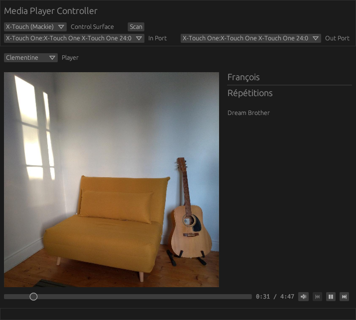

# media-player-controller 

`media-player-controller` is an interface to control a media player from a
Universal Control Surface such as the Behringer X-Touch One.

Currently, only MRPIS players can be controlled.



## Dependencies

This application uses the following crates which require system level libraries:

- [`egui`](https://crates.io/crates/egui) / [`eframe`](https://crates.io/crates/eframe) / [`winit`](https://crates.io/crates/winit).
- [`midir`](https://crates.io/crates/midir).

### Linux

Minimum dependencies include development libraries for:

- X11 or Wayland.
- `alsa` (`alsa-lib-devel`, `libasound2-dev`, ...)
- `dbus` (`dbus-devel`, ` libdbus-1-dev`, ...)

System level mixer control support is available using the `pulsectl`
(default) feature, which requires:

- `pulseaudio` (`pulseaudio-libs-devel`, `libpulse-dev`, ...)

## Build

You need a stable Rust toolchain for the target host. Get it from [this page](https://www.rust-lang.org/fr/tools/install).
On a Unix-like system, you should be able to install `rustup` from your packet
manager.

Clone the git tree and run the following command in an environment where
`cargo` is available:

```
cargo b --release
```

## Run

After a successful compilation, launch the executable with:

```
target/release/media-player-controller
```

## LICENSE

This crate is licensed under MIT license ([LICENSE-MIT](LICENSE-MIT) or
http://opensource.org/licenses/MIT)
